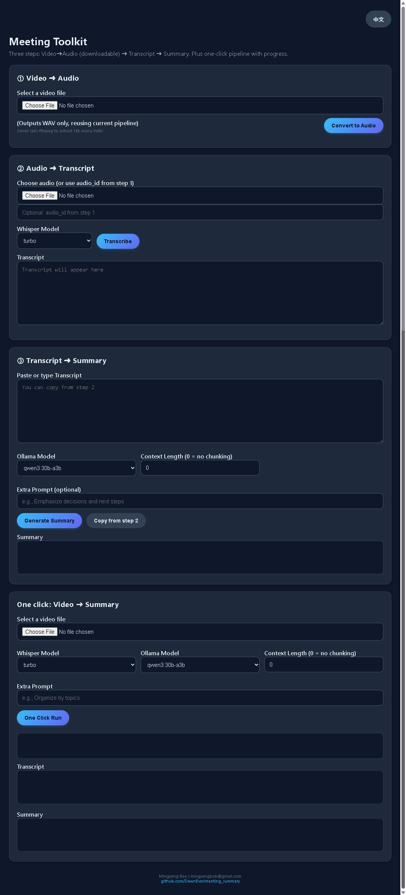

# Meeting Summary (Video → Whisper → Ollama)

Lightweight toolkit to convert meeting videos into transcripts and structured Markdown summaries using FFmpeg, Whisper, and a local Ollama model. Provides CLI modules for each stage and a simple Flask web UI for one-click or programmatic pipelines.

## Key features
- End-to-end pipeline: video → audio (FFmpeg) → transcript (Whisper) → summary (Ollama).
- Each stage usable independently (extract, transcribe, summarize).
- Optional Whisper language hint and SRT export when segment data is available.
- Automatic chunking of long transcripts and merge into a single Markdown summary.
- Outputs placed under a single `output/` directory. Optional Flask web UI with SSE progress.
 - Broad format support for input media (mainstream video & audio containers/codecs).

<p align="center">
	
</p>


## Requirements
- Python 3.13+
- [FFmpeg](https://ffmpeg.org/download.html) available on PATH
- [Ollama](https://ollama.com/download) running locally with the desired model pulled (default example: `qwen3:30b-a3b`)
- Choose an appropriate Whisper model for your hardware (CPU/GPU)

## Installation

Install package in editable mode:

Windows CMD:
```cmd
pip install -e .
REM Web UI (optional)
pip install -e ".[web]"
REM Dev tools (optional)
pip install -e ".[dev]"
```

Or use uv as alternatives:
```bash
uv pip install -e ".[dev,web]"
```

## Quick start — full pipeline

Process a meeting video end-to-end:
```bash
python -m meeting_summary path/to/meeting.mp4 -o output -w turbo -c 8000 -p "Focus on decisions and owners"
```

Important options:
- `-o, --outdir` : output directory for audio, transcripts, summaries
- `-w, --whisper-model` : Whisper checkpoint (e.g., tiny, base, small, medium, large, turbo)
- `-l, --language` : optional language hint for Whisper (e.g., en, zh)
- `-m, --ollama-model` : local Ollama model name (prefixed internally with `ollama/`)
- `-c, --context-length` : max characters per summarization request; set `0` to disable chunking
- `-p, --extra-prompt` : extra instructions appended to the summarization prompt

Typical outputs under `output/`:
- `<stem>.wav` — extracted mono audio
- `<stem>.transcript.txt` — raw Whisper transcript
- `<stem>.srt` — subtitles (if segment data exists)
- `<stem>.summary.md` — final Markdown summary from Ollama

### Supported media formats

Video ➜ Audio extraction accepts (containers):
`mp4, mov, mkv, avi, webm, m4v, flv, 3gp, ts, vob, wmv, mpeg, mpg, m2ts, ogv`

Audio ➜ Transcript accepts:
`wav, mp3, aac, ogg, flac, m4a, wma, webm (audio-only), opus`

Non-WAV audio can optionally be converted to mono 16kHz WAV before transcription for consistency:
add `--auto-convert-wav` (CLI) or rely on native Whisper decoding.

To simplify SRT timestamps (drop milliseconds) add `--simple-srt-time`.

## Run individual stages

Extract audio only:
```bash
python -m meeting_summary.extract_audio path/to/meeting.mp4 -o output --samplerate 16000
```

Transcribe existing WAV:
```bash
python -m meeting_summary.transcribe path/to/meeting.wav -o output -w turbo -l en
python -m meeting_summary.transcribe path/to/audio.mp3 -o output -w turbo -l en --auto-convert-wav
```

Summarize an existing transcript (with optional chunking and extra prompt):
```bash
python -m meeting_summary.summarize path/to/meeting.transcript.txt -o output -m qwen3:30b-a3b -c 6000 -p "Highlight risks"
```

When `-c/--context-length > 0`, the transcript is split into chunks sized to fit the context window. Each chunk is summarized, then merged into a single Markdown file with section headings.

## Web service (Flask)

Start the web UI:
```bash
python -m meeting_summary.web
```

Visit: http://localhost:8000/

The root page serves an English UI by default. Language can be selected via `?lang=zh|en`, a cookie, or `Accept-Language`.

Key API endpoints:
- POST `/api/video-to-audio` — upload video, returns `{audio_id, download_url}`
- GET `/api/download/audio/<audio_id>` — download extracted WAV
- GET `/api/download/transcript/<audio_id>` — download transcript (if available)
- GET `/api/download/srt/<audio_id>` — download SRT (if available)
- POST `/api/audio-to-transcript` — upload WAV or reference `audio_id`; returns `{transcript}`
- POST `/api/summarize` — JSON with `transcript`, optional `ollama_model`, `context_length`, `extra_prompt`; returns `{summary}`
- POST `/api/pipeline` — blocking pipeline; returns `{audio_id, download_url, transcript, summary}`
- POST `/api/pipeline/start` — start async pipeline; returns `{job_id}`
- GET `/api/pipeline/events/<job_id>` — SSE stream of progress events (`info/step/ok/error/done`)
- GET `/api/pipeline/result/<job_id>` — poll final result/status (`pending|error|done`)

SSE usage example:
```bash
curl -N http://localhost:8000/api/pipeline/events/<job_id>
```

Notes:
- Uploaded files and generated artifacts are stored under `output/` (uploads in `output/uploads/`).
- For proper SSE behavior behind proxies, disable buffering (e.g., `X-Accel-Buffering: no`).
- Add authentication, rate limiting, and job cleanup for production use.

## Extra prompting tips
- Keep `--extra-prompt` concise and focused for better summaries.
- Enable chunking if you encounter context window limits or truncated outputs.
- Post-process the generated Markdown in CI or import into note systems; format is stable.

## Development
- Optional linting/formatting with Ruff: `python -m ruff check .` and `python -m ruff format .`
- Helper scripts in `scripts/` show programmatic orchestration of the pipeline.
- Contributions welcome — open issues or PRs with improvements.
